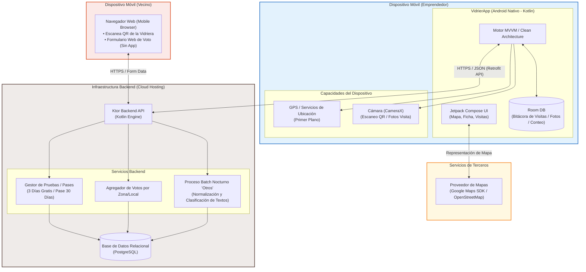

```mermaid
graph TB
    subgraph Dispositivo_Movil ["Dispositivo Móvil (Emprendedor)"]
        subgraph App_Android ["VidrierApp (Android Nativo - Kotlin)"]
            Android_UI["Jetpack Compose UI\n(Mapa, Ficha, Visitas)"]
            Android_Engine["Motor MVVM / Clean Architecture"]
            Room_Storage[("Room DB\n(Bitácora de Visitas / Fotos / Conteo)")]
        end
        
        subgraph Hardware_Sensors ["Capacidades del Dispositivo"]
            GPS["GPS / Servicios de Ubicación\n(Primer Plano)"]
            Camera["Cámara (CameraX)\n(Escaneo QR / Fotos Visita)"]
        end

        Android_Engine <--> Room_Storage
        Android_Engine --> GPS
        Android_Engine --> Camera
    end

    subgraph Dispositivo_Vecino ["Dispositivo Móvil (Vecino)"]
        Web_Browser["Navegador Web (Mobile Browser)\n• Escanea QR de la Vidriera\n• Formulario Web de Voto (Sin App)"]
    end

    subgraph Servicios_Externos ["Servicios de Terceros"]
        Map_Provider["Proveedor de Mapas\n(Google Maps SDK / OpenStreetMap)"]
    end

    subgraph Servidor_Cloud ["Infraestructura Backend (Cloud Hosting)"]
        API_Gateway["Ktor Backend API\n(Kotlin Engine)"]
        
        subgraph Procesos_Internos ["Servicios Backend"]
            Auth_Module["Gestor de Pruebas / Pases\n(3 Días Gratis / Pase 30 Días)"]
            Voto_Module["Agregador de Votos por Zona/Local"]
            Otro_Batch["Proceso Batch Nocturno 'Otros'\n(Normalización y Clasificación de Textos)"]
        end

        DB_Postgres[("Base de Datos Relacional\n(PostgreSQL)")]

        API_Gateway --> Auth_Module
        API_Gateway --> Voto_Module
        API_Gateway --> Otro_Batch
        Auth_Module --> DB_Postgres
        Voto_Module --> DB_Postgres
        Otro_Batch --> DB_Postgres
    end

    %% Conexiones
    Android_UI <--"Representación de Mapa"--> Map_Provider
    Android_Engine <--"HTTPS / JSON (Retrofit API)"--> API_Gateway
    Web_Browser <--"HTTPS / Form Data"--> API_Gateway

    style Dispositivo_Movil fill:#e3f2fd,stroke:#1565c0,stroke-width:2px
    style Dispositivo_Vecino fill:#fbe9e7,stroke:#d84315,stroke-width:2px
    style Servicios_Externos fill:#fff8e1,stroke:#f57f17,stroke-width:2px
    style Servidor_Cloud fill:#efebe9,stroke:#4e342e,stroke-width:2px
```

```mermaid
graph TD
    subgraph Capa_Presentacion ["Capa de Presentación (UI & State)"]
        UI["Composables (Jetpack Compose)<br/>• MapaScreen / FichaLocalScreen / RegistrarVisitaScreen"]
        UIState["UiState (Data Class immutable)<br/>• Loading / Success / Error / Offline"]
        VM["ViewModels<br/>• FichaLocalViewModel<br/>• VisitaViewModel"]
        
        UI -- "1. Captura eventos de usuario (User Intent)" --> VM
        VM -- "8. Expone UiState vía StateFlow" --> UIState
        UIState -- "9. Re-renderiza UI declarativa" --> UI
    end

    subgraph Capa_Dominio ["Capa de Dominio (Clean Architecture / Pure Kotlin)"]
        UC1["ConsultarFichaLocalUseCase"]
        UC2["RegistrarVisitaUseCase"]
        
        ModelLocal["Modelos de Dominio<br/>• Local, Voto, Rubro, Visita"]
        IRepo["Interfaces de Repositorio<br/>• LocalRepository<br/>• VisitaRepository"]

        VM -- "2. Invoca UseCase con Coroutines/Suspend" --> UC1
        VM -- "2. Invoca UseCase con Coroutines/Suspend" --> UC2
        UC1 -- "3. Ejecuta regla de negocio y llama Abstracción" --> IRepo
        UC2 -- "3. Ejecuta regla de negocio y llama Abstracción" --> IRepo
        UC1 -. "Usa" .-> ModelLocal
        UC2 -. "Usa" .-> ModelLocal
    end

    subgraph Capa_Datos ["Capa de Datos (Data & Sources)"]
        RepoImpl1["LocalRepositoryImpl"]
        RepoImpl2["VisitaRepositoryImpl"]
        
        Mapper["Mappers (DTO / Entity a Domain)"]
        
        RemoteDS["Remote DataSource<br/>(Retrofit Service)"]
        LocalDS["Local DataSource<br/>(Room DAO)"]

        RepoImpl1 -. "4. Implementa interfaz" .-> IRepo
        RepoImpl2 -. "4. Implementa interfaz" .-> IRepo

        RepoImpl1 -- "5a. Solicita datos remotos (Locales/Votos)" --> RemoteDS
        RepoImpl2 -- "5b. Persiste/Lee localmente (Visitas)" --> LocalDS

        RemoteDS -- "6a. Devuelve LocalDto / VotoDto" --> Mapper
        LocalDS -- "6b. Devuelve VisitaEntity" --> Mapper
        
        Mapper -- "7. Transforma a Modelo de Dominio" --> IRepo
    end

    subgraph External ["Fuentes Externas & Backend"]
        API_Backend["Backend Ktor (API REST JSON)"]
        Room_DB[("Base de Datos Local<br/>(SQLite / Room)")]

        RemoteDS <== "HTTP/REST (Retrofit)" ==> API_Backend
        LocalDS <== "Lectura / Escritura" ==> Room_DB
    end

    style Capa_Presentacion fill:#e1f5fe,stroke:#01579b,stroke-width:2px
    style Capa_Dominio fill:#f3e5f5,stroke:#4a148c,stroke-width:2px
    style Capa_Datos fill:#e8f5e9,stroke:#1b5e20,stroke-width:2px
    style External fill:#fff3e0,stroke:#e65100,stroke-width:2px
```
